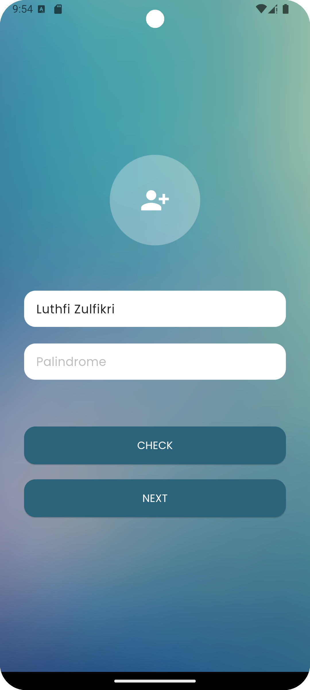
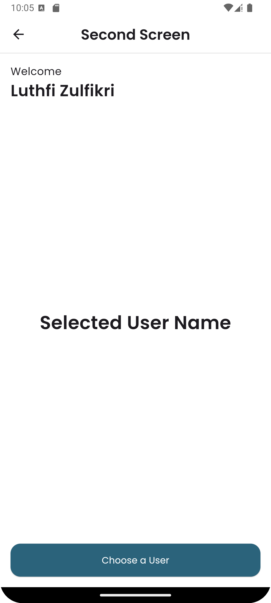
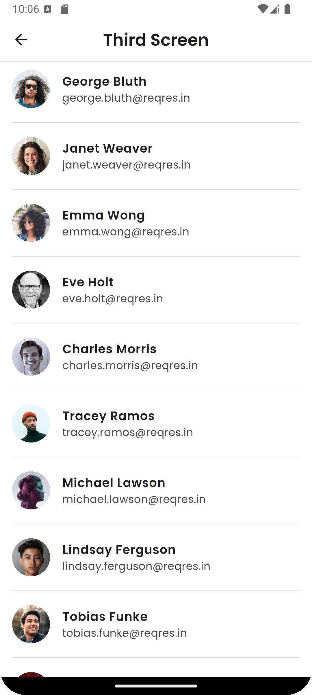

# Suitmedia Mobile Dev Assessment

Proyek ini adalah aplikasi Flutter yang dibuat untuk *assessment test* di Suitmedia. Aplikasi ini terdiri dari tiga layar utama dengan fungsionalitas seperti pengecekan palindrom, manajemen pengguna, dan menampilkan daftar pengguna dari API.

## 📜 Daftar Isi

* [Fitur Utama](https://www.google.com/search?q=%23-fitur-utama)
* [Tangkapan Layar](https://www.google.com/search?q=%23-tangkapan-layar)
* [Teknologi & Library](https://www.google.com/search?q=%23-teknologi--library)
* [Struktur Proyek](https://www.google.com/search?q=%23-struktur-proyek)
* [Cara Menjalankan Proyek](https://www.google.com/search?q=%23-cara-menjalankan-proyek)

-----

## ✨ Fitur Utama

* **Pengecekan Palindrom**: Memeriksa apakah sebuah kalimat merupakan palindrom atau bukan.
* **Navigasi Antar Layar**: Perpindahan data nama pengguna antar layar.
* **Manajemen Pengguna**: Menampilkan nama pengguna yang dipilih dari daftar.
* **Daftar Pengguna dari API**: Menampilkan daftar pengguna yang datanya diambil dari API publik `reqres.in`.
* **Pull to Refresh & Infinite Scrolling**: Memuat ulang dan memuat lebih banyak data pengguna dengan mekanisme *pull-to-refresh* dan *infinite scroll*.

-----

## 📱 Tangkapan Layar

|          First Screen           |                   Second Screen                   |                  Third Screen                   |
|:-------------------------------:|:-------------------------------------------------:|:-----------------------------------------------:|
|  |  |  |


-----

## 🛠️ Teknologi & Library

* **Flutter**: Framework UI dari Google untuk membangun aplikasi multi-platform.
* **GetX**: *State management*, *dependency injection*, dan *route management*.
* **Dio**: Klien HTTP untuk mengambil data dari API.
* **pull\_to\_refresh**: *Library* untuk fungsionalitas *pull-to-refresh* pada daftar.

-----

## 📂 Struktur Proyek

Proyek ini menggunakan struktur direktori yang umum pada aplikasi Flutter dengan GetX.

```
lib
├── app
│   ├── config.dart
│   ├── data
│   │   ├── models
│   │   │   └── user_model.dart
│   │   └── services
│   │       └── api_service.dart
│   ├── modules
│   │   ├── first_screen
│   │   │   ├── first_screen_controller.dart
│   │   │   └── first_screen_view.dart
│   │   ├── second_screen
│   │   │   ├── second_screen_controller.dart
│   │   │   └── second_screen_view.dart
│   │   └── third_screen
│   │       ├── third_screen_controller.dart
│   │       └── third_screen_view.dart
│   ├── routes
│   │   ├── app_pages.dart
│   │   └── app_routes.dart
│   └── widgets
│       ├── custom_button.dart
│       ├── custom_dialog.dart
│       └── custom_text_field.dart
└── main.dart
```

-----

## 🚀 Cara Menjalankan Proyek

1.  **Pastikan Flutter sudah terinstal.** Jika belum, ikuti petunjuk instalasi di [situs resmi Flutter](https://flutter.dev/docs/get-started/install).
2.  **Clone repositori ini.**
    ```bash
    git clone https://github.com/lutzzzx/Flutter_Test.git
    ```
3.  **Masuk ke direktori proyek.**
    ```bash
    cd Flutter_Test
    ```
4.  **Instal semua *dependency* yang dibutuhkan.**
    ```bash
    flutter pub get
    ```
5.  **Jalankan aplikasi.**
    ```bash
    flutter run
    ```

-----

## 📄 Dokumentasi Proyek

### **Arsitektur**

Aplikasi ini mengadopsi pola arsitektur **Model-View-Controller (MVC)** dengan bantuan *library* **GetX**. Setiap fitur atau layar utama dipisahkan ke dalam *modules* tersendiri yang masing-masing memiliki:

* **View**: Bertanggung jawab untuk menampilkan antarmuka pengguna (UI). File-file ini berada di `app/modules/[nama_fitur]/[nama_fitur]_view.dart`.
* **Controller**: Mengelola *state* dan *business logic* dari *view*. File-file ini berada di `app/modules/[nama_fitur]/[nama_fitur]_controller.dart`.
* **Model**: Merepresentasikan struktur data yang digunakan dalam aplikasi, seperti `User`.

### **Alur Kerja Aplikasi**

1.  **First Screen**

    * Pengguna memasukkan nama pada `CustomTextField`.
    * Pengguna memasukkan sebuah kalimat untuk dicek apakah palindrom atau tidak.
    * Tombol `CHECK` akan memvalidasi kalimat dan menampilkan dialog `isPalindrome` atau `not palindrome`.
    * Tombol `NEXT` akan memindahkan pengguna ke `SecondScreen` dengan membawa data nama yang telah diinput.

2.  **Second Screen**

    * Menampilkan nama pengguna yang didapat dari `FirstScreen`.
    * Menampilkan nama pengguna yang dipilih dari `ThirdScreen`. Awalnya, teks yang ditampilkan adalah "Selected User Name".
    * Tombol `Choose a User` akan membawa pengguna ke `ThirdScreen` untuk memilih pengguna.

3.  **Third Screen**

    * Menampilkan daftar pengguna dari API `https://reqres.in/api/users`.
    * Menggunakan `pull_to_refresh` untuk memuat ulang data dan *infinite scrolling* untuk memuat data pada halaman selanjutnya.
    * Ketika seorang pengguna dipilih dari daftar, aplikasi akan kembali ke `SecondScreen` dan menampilkan nama lengkap pengguna yang dipilih.

### **Komponen Penting**

* `main.dart`: Titik masuk utama aplikasi. Menginisialisasi `GetMaterialApp` dan mendefinisikan rute awal serta tema aplikasi.
* `app_pages.dart` & `app_routes.dart`: Mengelola semua rute navigasi dalam aplikasi menggunakan GetX.
* `api_service.dart`: Bertanggung jawab untuk melakukan panggilan HTTP ke API `reqres.in` menggunakan `Dio` untuk mengambil data pengguna.
* `user_model.dart`: Mendefinisikan model data `User` yang digunakan untuk mem-parsing data JSON dari API.
* **Widget Kustom**:
    * `CustomButton`: Tombol yang dapat digunakan kembali dengan gaya yang konsisten di seluruh aplikasi.
    * `CustomTextField`: Kolom input teks dengan gaya yang seragam.
    * `CustomDialog`: Dialog kustom untuk menampilkan pesan, seperti hasil pengecekan palindrom.